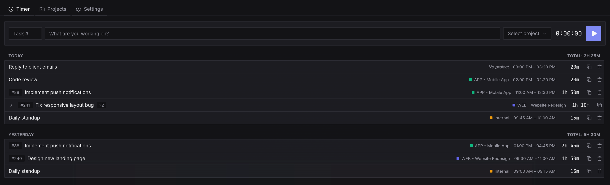

# Chronos

A manual time tracker for people who just want to press play, work, and press stop — 100% local, offline, and open source. Built as a lightweight alternative to Clockify for people who don't need a team dashboard, just an honest log of their own time.

[](https://github.com/RickCaleg/chronos/actions/workflows/ci.yml)




## Features

- **Manual timer** — description, optional task number, project, play/stop. Nothing automatic, nothing guessed.
- **Edit time freely** — change the start time while the timer is running, or the start, end, and/or total duration after it's stopped. Editing duration keeps the start fixed and recalculates the end (and vice versa), matching the convention most time-tracking tools use.
- **Plain-text date/time editing** — no calendar widgets. Type `2026-01-31 14:30:00`, or just `14:30` to change the time and keep the same day.
- **Projects with color and a short code** — give a project a code (e.g. `MRK`) and it shows as `MRK - Project Name` everywhere.
- **One field for task + description** — type `#1234 fix login bug` and it's split live into task number and description as you type. Paste the fuller `#1234 - MRK - Fix login bug` (e.g. from an old Clockify description) and it also picks out the project by code. The same rule applies when importing CSVs, and autocomplete on this field recalls the project a task was last used with too.
- **Group similar entries** — entries with the same task, description, and project on the same day collapse into one row with a total, expandable to see each session.
- **Import / export** — full JSON backup, CSV export/import, and a dedicated Clockify CSV importer (matches Clockify's pt-BR export columns and applies the same paste-autofill rule to fill in task/project when they're embedded in the description).
- **A real CLI** ([`chronos-cli`](docs/CLI.md)) — start/stop/list/edit entries, manage projects, export/import, and automate backups from a script, cron job, or a window-manager status bar widget. Reads and writes the same database as the GUI.
- **Fully keyboard-driven** — `Ctrl+Enter` starts/stops the timer, `Alt+1/2/3` switches tabs, `Enter` saves in editors, `Esc` closes popovers, arrow keys navigate autocomplete.
- **Bilingual** — English and Portuguese (pt-BR), switchable in Settings.
- **Theme-aware** — light, dark, follows the OS, or (on Linux) follows your [Omarchy](https://omarchy.org) theme live.
- **Native by platform** — native title bar on Windows, native GTK decorations on Linux desktop environments, no title bar at all under a standalone window manager (Hyprland, sway, i3, ...).
- **Your data stays yours** — a local SQLite database, no network calls, no telemetry, no account.
- **Self-updating** — checks GitHub Releases for a newer version on launch, plus a manual "Check for updates" button in Settings. Updates are cryptographically signed and verified before installing.

## Tech stack

[Tauri 2](https://tauri.app) (Rust) · [React 19](https://react.dev) + TypeScript · [Tailwind CSS 4](https://tailwindcss.com) · SQLite · [Zustand](https://github.com/pmndrs/zustand) · [i18next](https://www.i18next.com)

## Installing

- **Arch Linux**: not yet on the AUR (registrations are temporarily closed there), but `packaging/aur/PKGBUILD` builds the same package AUR would host:
  ```sh
  git clone https://github.com/RickCaleg/chronos.git
  cd chronos/packaging/aur
  makepkg -si
  ```
  This installs `chronos` and `chronos-cli` via pacman, with a proper `.desktop` entry and icons. Once AUR registration reopens we'll publish it there too.

  Always get the `PKGBUILD` this way (a fresh clone of `master`), not from inside a downloaded release archive/zip — packaging fixes ship as plain commits to `packaging/aur/` without a new app release, so a `PKGBUILD` frozen inside an old release's source archive can be missing them.
- **Other Linux / Windows**: grab an installer from the [latest release](https://github.com/RickCaleg/chronos/releases/latest) (`.deb`, `.rpm`, `.AppImage`, or `.msi`/`.exe`).

## Getting started

### Prerequisites

- [Node.js](https://nodejs.org) 20+
- [Rust](https://www.rust-lang.org/tools/install) (stable toolchain)
- The platform dependencies for [Tauri 2](https://tauri.app/start/prerequisites/) (on Linux, this is mainly `webkit2gtk` and friends — the linked page has the exact package names per distro)

### Development

```sh
npm install
npm run tauri dev
```

### Building a release binary

```sh
npm run tauri build
```

The installer/binary is produced under `src-tauri/target/release/bundle/`.

This repo is a Cargo workspace with two Rust crates: `src-tauri` (the desktop app) and `cli` (the [`chronos-cli`](docs/CLI.md) companion). Build just the CLI with:

```sh
cargo build --release -p chronos-cli
```

### Publishing a release

Pushing a tag matching `v*` (e.g. `v0.1.0`) triggers the [release workflow](.github/workflows/release.yml), which builds installers for Linux and Windows and attaches them to a **draft** GitHub release for review before publishing:

```sh
git tag v0.1.0
git push origin v0.1.0
```

The workflow also signs the build (using the `TAURI_SIGNING_PRIVATE_KEY`/`TAURI_SIGNING_PRIVATE_KEY_PASSWORD` repo secrets) and publishes a `latest.json` manifest, which is what lets already-installed copies of Chronos find and verify this release automatically. Only versions from **0.3.0 onward** ship the updater itself, so 0.1.0/0.2.0 installs can't auto-update — people on those need to grab a new installer once, manually, after which auto-update takes over.

## Auto-updates

Chronos checks `github.com/RickCaleg/chronos/releases/latest` on launch and whenever you click **Check for updates** in Settings. Updates are downloaded and verified against a public key baked into the app before being installed — see [CONTRIBUTING.md](CONTRIBUTING.md#releasing) if you're maintaining a fork and need to re-key this.

## Data & backups

Everything lives in a local SQLite database (in the OS's standard app-data directory — nothing is ever synced or uploaded). Use **Settings → Data** to:

- Export a full JSON backup (and import it back on any machine)
- Export/import entries as CSV
- Import directly from a Clockify CSV export
- Erase everything and start fresh

All of this is also available from the terminal — see [`docs/CLI.md`](docs/CLI.md) for the full `chronos-cli` reference, including automating backups with cron and wiring Chronos into a window-manager/Omarchy status bar.

## Contributing

Contributions are welcome — see [CONTRIBUTING.md](CONTRIBUTING.md) for how to set up the project and what to keep in mind before opening a PR.

## License

[MIT](LICENSE)
